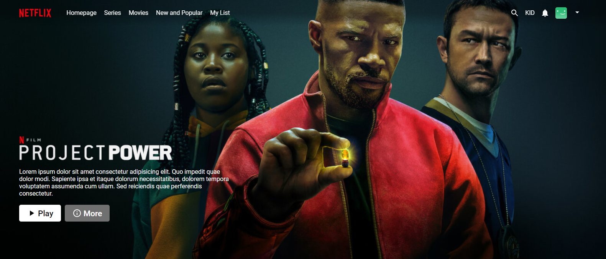
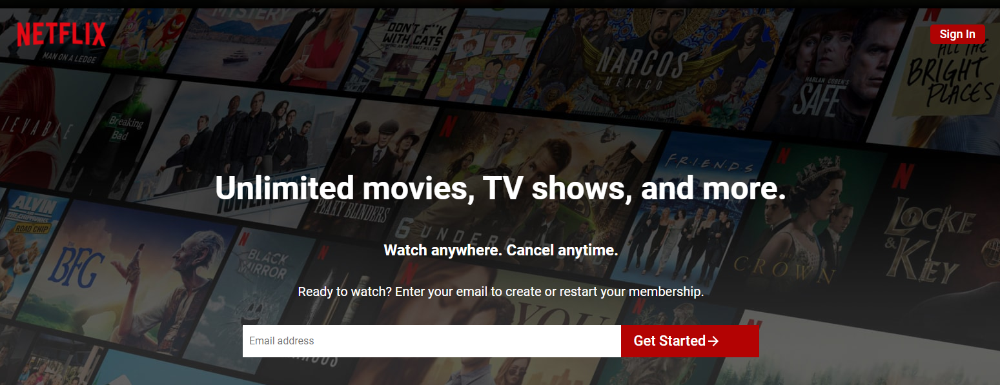
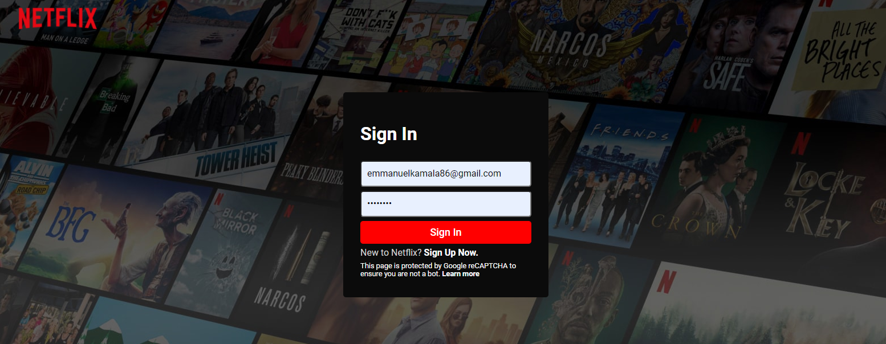

# Movie App

This is a movie application where users can watch movies and series online. It's a clone of the Netflix application.

# Live Demo
Coming soon...

## Built With

- ReactJS
- NodeJS
- CSS
- MongoDB

## Getting Started

Open your terminal or text editor and use next command

        git clone https://github.com/emmanuelkamala/movie-app.git

        cd backend
        ### run 'npm install' to install dependencies
        ### npm start

        cd frontend
        ### run 'npm install' to install dependencies
        ### npm start

## Opening the app

Then open the browser and enter this link:
http://localhost:3000

After if you want to do any changes please create new branch, after changes open pull request.
Happy coding! 

## Authors

👤 **Author1**

- Github: [emmanuelkamala](https://github.com/emmanuelkamala)
- Twitter: [ejkamala](https://twitter.com/ejkamala)
- Linkedin: [emmanuelkamala](https://linkedin.com/in/emmanuelkamala)

## 🤝 Contributing

Contributions, issues and feature requests are welcome!

Feel free to check the [issues page](issues/).

## Show your support

Give a ⭐️ if you like this project!

## 📝 License

This project is [MIT](lic.url) licensed.
